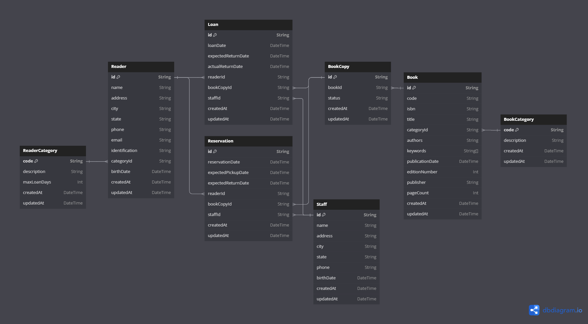

# Problematica
O sistema para a Biblioteca consiste do gerenciamento dos empréstimos de obras literárias, bem como da devolução dessas obras.

O sistema deve permitir a inclusão, alteração e remoção de leitores da biblioteca, com os seguintes atributos: nome, endereço, cidade, estado, telefone, email, documento de identificação, categoria de leitor e data de nascimento.

O sistema deve permitir a inclusão, alteração e remoção das diversas categorias de leitores, com os seguintes atributos: código da categoria, descrição da categoria e número máximo de dias que essa categoria de leitor pode emprestar uma obra.

Exemplos de categorias de leitores são: aluno de graduação, aluno de pós-graduação, professor, funcionário e usuário externo. 

Exemplos de categorias de obras literária são: livro, periódico, revista, nota didática, jornal, relatório técnico, tese de doutorado e dissertação de mestrado.

O sistema deve permitir a inclusão, alteração e remoção das obras literárias da biblioteca. Cada obra possui os seguintes atributos: código, ISBN, título da obra, código da categoria de obra literária, autores, palavras-chave, data da publicação, número de edição, editora e número de página. Cada obra pode possuir uma ou mais cópias na biblioteca. Assim, o sistema deve atribuir um identificador único à cada uma das cópias. 

O sistema deve permitir a inclusão, alteração e remoção de funcionários da biblioteca, com os seguintes atributos: nome, endereço, cidade, estado, telefone e data de nascimento.

O sistema deve permitir o processamento da reserva da obra literária, com os seguintes atributos: data da reserva, data prevista para retirada da obra, data prevista para devolução, identificação do leitor, código da obra, funcionário responsável pela reserva.

A reserva só deve ser permitida se houverem obras disponíveis no período indicado. 

Caso contrário o sistema deve emitir uma mensagem de alerta e a reserva não pode ser confirmada.

O sistema deve permitir o empréstimo de uma obra literária por um leitor. Cada empréstimo possui os seguintes atributos: data de empréstimo da obra, data prevista para devolução, identificação do leitor (previamente cadastrado), funcionário responsável pelo empréstimo e 2 identificação da cópia da obra emprestada.

O sistema deve permitir a devolução da obra por um leitor, com os seguintes 
atributos: identificação da cópia da obra emprestada, data de devolução da obra.

O sistema deve automaticamente calcular uma multa se a data de devolução for superior à data prevista para devolução da obra. O valor da multa é calculado multiplicando-se o número de dias de atraso pela taxa diária de atraso, de acordo com a categoria de obra literária.

# Modelo Entidade Relacionamento (MER)

```sql
Table Reader {
  id String [pk]
  name String
  address String
  city String
  state String
  phone String
  email String [unique]
  identification String [unique]
  categoryId String
  birthDate DateTime
  createdAt DateTime
  updatedAt DateTime
}

Table ReaderCategory {
  code String [pk]
  description String
  maxLoanDays Int
  createdAt DateTime
  updatedAt DateTime
}

Table Book {
  id String [pk]
  code String [unique]
  isbn String [unique]
  title String
  categoryId String
  authors String
  keywords String[]
  publicationDate DateTime
  editionNumber Int
  publisher String
  pageCount Int
  createdAt DateTime
  updatedAt DateTime
}

Table BookCategory {
  code String [pk]
  description String
  createdAt DateTime
  updatedAt DateTime
}

Table BookCopy {
  id String [pk]
  bookId String
  status String [default: "AVAILABLE"]
  createdAt DateTime
  updatedAt DateTime
}

Table Staff {
  id String [pk]
  name String
  address String
  city String
  state String
  phone String
  birthDate DateTime
  createdAt DateTime
  updatedAt DateTime
}

Table Reservation {
  id String [pk]
  reservationDate DateTime
  expectedPickupDate DateTime
  expectedReturnDate DateTime
  readerId String
  bookCopyId String
  staffId String
  createdAt DateTime
  updatedAt DateTime
}

Table Loan {
  id String [pk]
  loanDate DateTime
  expectedReturnDate DateTime
  actualReturnDate DateTime
  readerId String
  bookCopyId String
  staffId String
  createdAt DateTime
  updatedAt DateTime
}

Enum Status {
  AVAILABLE
  ON_LOAN
  RESERVED
  LOST
}

Ref: Reader.categoryId > ReaderCategory.code
Ref: Book.categoryId > BookCategory.code
Ref: BookCopy.bookId > Book.id
Ref: Reservation.readerId > Reader.id
Ref: Reservation.bookCopyId > BookCopy.id
Ref: Reservation.staffId > Staff.id
Ref: Loan.readerId > Reader.id
Ref: Loan.bookCopyId > BookCopy.id
Ref: Loan.staffId > Staff.id
```